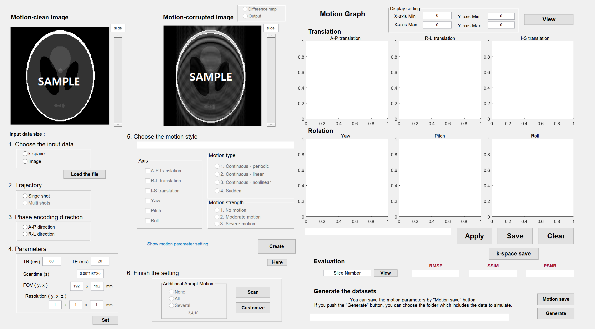

# MRI motion artifact simulation tool (View2Dmotion)
This is the source codes of motion artifact simulation in MRI.   
</img>
   
 

## Publised Paper
The paper entitled : **"Deep Learning in MR Motion Correction: a Brief Review and a New Motion Simulation Tool (view2Dmotion)"** is published to Investigative Magnetic Resonance Imaging.
 
 
## Usage
Run <code>view2Dmotion</code> in matlab.
The main explanation about the simulation tool is mentioned in the paper.

 
For any questions about the code, please contact me (Seul Lee) at: tmf789@yonsei.ac.kr
